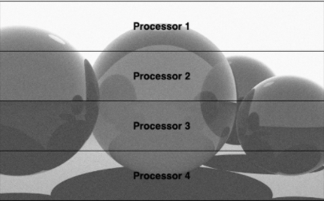

# Parallel Ray Tracing

## Introduction

<!--  -->

  

In computer graphics, ray tracing is a technique for generating image frames by tracing the path of light as pixels in an image plane and simulating the effect of that light path hitting objects in its trajectory.

The technique allows for a high level of visual realism but comes at a much higher computational cost than traditional rendering techniques. For that reason, it can be used for applications that allow for long render times, such as movie and tv, but traditionally has not been useable for real-time applications like video games.

In this project, we explore the difference between ray tracing on CPU and GPU and speed up using methods like dynamic load balancing and bounding volume.

## Personal Contributions/Implementation Details

##### In this project, my contributions were converting a ray tracing algorithm to be parallelized using Open MPI.

  

Because of the nature of ray tracing, the computation time of a given primary ray is directly related to number of bounces and interactions the ray has with objects. The scene above is broken up into portions that are distributed by a master node to worker nodes via Open MPI. 

The master processor distributes one row per processor, and receives the completed pixel colors from each worker. Once a worker completes a row and the master receives its data, the master processor distributes the next row to the processor, and the process continues until all rows are completed.

This is implemented using MPI. Each processor contains a copy of the scene data, all objects and their corresponding data. The master processor loops works from the top row down, distributing rows as integers, and receiving arrays of pixel data using a custom struct of three floats (representing RGB values). The worker processor waits for the master processor to send a row to compute, computes the row, returns the finished data, and waits for a new row. Once, all rows are computed, the master processor sends a termination signal to the worker processors and finally saves the computed image.

